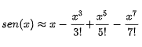

**UNIVERSIDADE LUSÓFONA DE HUMANIDADES E TECNOLOGIAS**

*Linguagens de Programação I*

# Exercício 0

Este exercício serve três objectivos principais:
- Familiarização com a ferramenta pandora
- Criar um programa simples em linguagem C
- Praticar o desenvolvimento e teste de programas em linuguagem C.

Na resolução destes exercícios deve ser utilizada a Linguagem de Programação C. Para além da correta implementação dos requisitos, tenha em conta os seguintes aspetos:
- O código apresentado deve ser bem indentado. 
- O código deve compilar sem erros ou *warnings* utilizando o *gcc* com as seguintes flags:
- `-g -Wvla -Wall -Wpedantic -Wextra -Wdeclaration-after-statement`
- Tenha em atenção os nomes dados das variáveis, para que sejam indicadores daquilo que as mesmas vão conter.
- O trabalho deve ser desenvolvido e submetido de forma individual.
- Atenção que a flag de compilação -Wdeclaration-after-statement obriga a que as variáveis sejam declaradas no principio das funções. Ou seja, não pode haver variáveis declaradas a meio das funções.

## Entrega

Este exercício deverá ser submetido na plataforma Pandora até às 23:59 do dia 6/3/2022 e será contabilizado para a nota final da unidade curricular de acordo com os critérios disponibilizados na página da disciplina, concretamente nos slides da primeira aula.

## Pandora

1. Em primeiro lugar deverá ter uma conta no github (https://github.com/). Se criar uma conta nova no github é conveniente usar o seu email institucional e colocar o seu nome e número mecanográfico como nome de utilizador. Exemplo ```anasilva21908445```.
2.	Aceda à plataforma PANDORA (https://saturn.ulusofona.pt/) e pressine o botão que diz **Sign In with Git-Hub**.
    *Nota. O acesso ao Pandora é feito com as credenciais do github. Isso significa que o Pandora não guarda passwords. A única informação que é passada ao Pandora é o vosso nome de utilizador.*
**Se perder a password, deve recuperar a password utilizando o mecanismo disponibilizado pelo github. NUNCA DEVERÁ CRIAR UMA CONTA NOVA.**
**Se criar uma conta nova irá perder todas as avaliações feitas pelo pandora.**

3.	Após login no PANDORA, clickar em Contests, e depois completar a informação colocando o número e o nome completo. É extremamente importante que coloque o número correcto na plataforma.

4.	Nesta fase deverá contactar o seu professor das práticas para que a sua conta seja activada. Para isso deverá enviar um email informando de que já completou o seu registo na plataforma. Deverá indicar o seu número de aluno para que seja verificado.

5. Espere algum tempo (até 24h) para que a conta seja activada. Só depois disso poderá começar a submeter.

## Descrição do exercício

Crie um programa que pede um angulo `alpha` (em graus) ao utilizador e em seguida calcula o resultado da função trigonométrica `sen(alpha)` utilizando a fórmula da expansão em série de Taylor de quarta ordem. I.e.:



Note que, na fórmula, `x` está em radianos, pelo que primeiro deverá converter de graus para radianos. Para isso definir uma constante com o valor de `PI=3.14159`. Resolva o problema sem utilizar a biblioteca math.h. 

### Detalhes de implementação
Ao iniciar, o programa imprime a mensagem exacta:

```Por favor indique um valor em graus\n```

O valor introduzido pelo utilizador deverá ser gravado numa variável do tipo `float`. Em seguida o programa deverá efectuar os cálculos necessários. Se necessitar de utilizar variáveis auxiliares, estas devem ser do tipo `double` de forma que não perca precisão com os cálculos intermédios.

O resultado deverá ser apresentado com a seguinte mensagem:

```Resultado = valor\n```

E em seguida o programa deverá terminar com o código de retorno 0.
O valor do resultado deverá ser apresentado com duas casas decimais.

Exemplo
```
Por favor indique um valor em graus
10
Resultado = 0.17
```


## Submissão no pandora

Para submeter o trabalho, seleccione o ficheiro source code (ficheiro .c).

Caso obtenha um erro de compilação a seguinte informação será mostrada


Se pressionar o botão que diz `show`, conseguirá visualizar a mensagem retornada pelo compilador.

## Honestidade Académica

Nesta disciplina, espera-se que cada aluno siga os mais altos padrões de honestidade académica. Trabalhos que sejam identificados como cópias serão anulados e os alunos envolvidos terão nota zero - quer tenham copiado, quer tenham deixado copiar.
Para evitar situações deste género, recomendamos aos alunos que nunca partilhem ou mostrem o seu código.
A decisão sobre se um trabalho é uma cópia cabe exclusivamente aos docentes da unidade curricular.
Os alunos são encorajados a discutir os problemas com outros alunos mas não deverão, no entanto, copiar códigos, documentação e relatórios de outros alunos. Em nenhuma circunstância deverão partilhar os seus próprios códigos, documentação e relatórios. De facto, não devem sequer deixar códigos, documentação e relatórios em computadores de uso partilhado.


